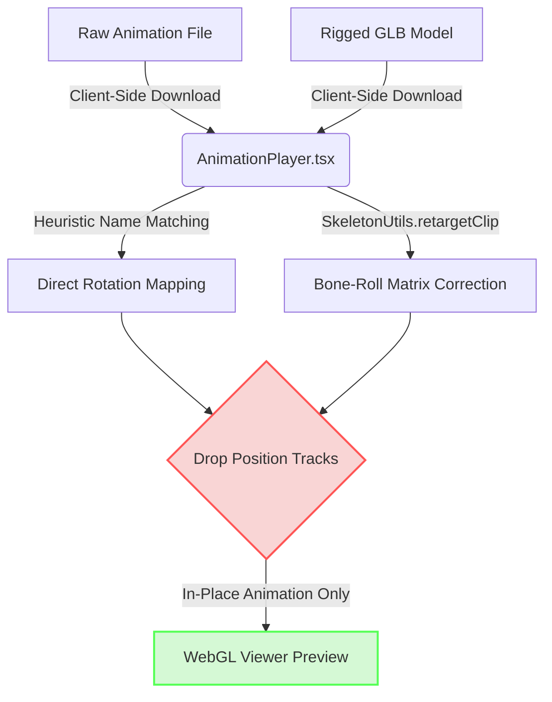

# RigFlow Animation Rework: Proposal & Hypothesis

**Author**: Antigravity (AI Coding Assistant)  
**Date**: June 16, 2026  
**Context**: Reworking the animation and retargeting pipeline to ensure high-fidelity deformations, proper rest-pose alignment, root-motion propagation, and industry-standard export compatibility.

---

## 1. Executive Summary & Hypothesis

### Current Situation
RigFlow currently utilizes a client-side retargeting model in the browser via [AnimationPlayer.tsx](file:///C:/Users/dzodz/OneDrive/Desktop/Rigflow/rigflow-project/frontend/src/components/AnimationPlayer.tsx). It dynamically loads source clips (primarily Mixamo-formatted FBX/GLB files), matches bone names using heuristics and hardcoded maps, and retargets bone rotations using three.js `SkeletonHelper` / `SkeletonUtils.retargetClip`. Position and scale tracks are stripped completely to prevent root translation issues, resulting in characters that animate strictly in place. Skinning deformations are bound via `bind_auto_weights` in [blender_autorig.py](file:///C:/Users/dzodz/OneDrive/Desktop/Rigflow/rigflow-project/backend/scripts/blender_autorig.py), but frequently trigger bone-heat failures and require nearest-bone fallback patches.

### The Hypothesis
> **By establishing a dual-layer retargeting strategy—coupling high-performance client-side previews (with rest-pose alignment and scale-normalized root-motion translation) with an automated server-side Blender retargeting and baking export pipeline—we can deliver game-engine-ready rigged characters that deform flawlessly, move naturally across 3D space, and import seamlessly into Unity, Unreal, and Godot.**

---

## 2. Deep Dive: Current Architecture & Limitations

To implement a successful rework, we must address the root causes of our current limitations in [blender_autorig.py](file:///C:/Users/dzodz/OneDrive/Desktop/Rigflow/rigflow-project/backend/scripts/blender_autorig.py) and [AnimationPlayer.tsx](file:///C:/Users/dzodz/OneDrive/Desktop/Rigflow/rigflow-project/frontend/src/components/AnimationPlayer.tsx):

1. **Stripped Root Motion**: 
   - Position tracks are fully discarded because three.js applies translation directly in scene units. A Mixamo clip in centimeters applied to a meter-scaled character causes the model to fly off-screen.
   - *Consequence*: We cannot preview or export animations that require translation (walks, runs, jumps, climbing).
2. **Rest-Pose Misalignment (T-Pose vs. A-Pose)**:
   - `SkeletonUtils.retargetClip` samples world rotations, but if the source animation rest-pose differs from the target model's rest-pose (e.g., A-pose target, T-pose source), the joints twist or bend inward.
3. **Loss of Rig Portability**:
   - Because retargeting occurs entirely in the user's browser, downloading the rigged model leaves you with a static character. The animations are not baked into the GLB/FBX, forcing the user to rebuild the retargeting logic in their own engine (Unity/Unreal).
4. **Fragile Bone Mapping**:
   - `FALLBACK_MIXAMO_TO_DEF` in [AnimationPlayer.tsx](file:///C:/Users/dzodz/OneDrive/Desktop/Rigflow/rigflow-project/frontend/src/components/AnimationPlayer.tsx) relies on a static vocabulary. If a user uploads a custom animation using a different skeleton naming convention (e.g., Unreal Mannequin structure or custom naming from Blender), it fails to bind.

---

## 3. The Best Ideas: Strategies for the Rework

### A. Scale-Normalized Root Motion (Translational Retargeting)
Instead of deleting all position tracks, we should extract the root translation (typically the `Hips` or `root` bone) and scale it relative to the height difference between the source and target characters.
- **Formula**: 
  $$\text{Target Position} = \text{Source Position} \times \left( \frac{\text{Target Character Height}}{\text{Source Character Height}} \right)$$
- **Result**: Characters will walk, run, and jump relative to their physical dimensions, eliminating foot-sliding while keeping the character within visual boundaries.

### B. Dual-Layer Retargeting (Client Preview + Server Bake)
We split the animation system into two distinct workflows:
1. **Interactive Preview Layer (Frontend)**: Real-time, instant playback using Three.js. 
2. **Production Export Layer (Backend)**: When a user clicks "Export with Animations," [tasks.py](file:///C:/Users/dzodz/OneDrive/Desktop/Rigflow/rigflow-project/backend/apps/rigging/tasks.py) spins up a Blender subprocess. Blender loads the target mesh, imports the chosen animation files, performs a precise native constraint-based retarget, and exports a single GLB/FBX containing the skeletal mesh and the active NLA (Non-Linear Animation) tracks.

### C. Active Rest-Pose Calibration
Before retargeting:
- Compute the relative offset matrices between the source skeleton's rest pose and the target skeleton's rest pose.
- Apply this offset matrix as a pre-multiplier to all rotation tracks.
- This ensures that if a model is rigged in a 45° A-pose, it will correctly adapt to animations captured from a 0° T-pose model without arm-twisting.

### D. Geodesic Voxel Skinning Fallback (Server-Side)
To prevent the dreaded `Bone Heat Weighting: failed to find solution` error:
- If Blender's native `ARMATURE_AUTO` fails, instead of falling back to a simplistic Euclidean nearest-bone weight assignment (which makes joints stiff), we can implement a voxel-based distance field solver inside [blender_autorig.py](file:///C:/Users/dzodz/OneDrive/Desktop/Rigflow/rigflow-project/backend/scripts/blender_autorig.py).
- We can approximate this by voxelizing the mesh bounds or running a decimation pass on a duplicate geometry to calculate heat diffusion, then copying the weights back to the original hi-poly model.

---

## 4. Potential Errors & Risks to Mitigate

| Risk / Error | Description | Mitigation Strategy |
| :--- | :--- | :--- |
| **Foot Sliding / Skidding** | Root motion scaling doesn't perfectly match stride lengths, making feet slide across the floor grid. | Implement an optional "IK Grounding" shader or adjust the root-translation scaling coefficient based on leg-length ratios rather than total height. |
| **Blender Process Bottlenecks** | Baking multiple animations into an FBX/GLB on the backend can consume significant CPU and memory resources. | Offload export bakes to Celery worker queues with strict rate limits, and cache retargeted animation assets on Django media storage. |
| **Twisted Joints (Bone Roll Mismatch)** | Rigify `DEF-` bones have customized bone rolls (local axes) which differ from standard game-engine standards. | Ensure the bone mapping dict contains local rotation offset matrices, or force a bone-roll correction pass inside Blender before stripping control bones. |
| **UI Thread Blocking** | Retargeting long clips (e.g., full 60-second dances) client-side can freeze the browser. | Move the `SkeletonUtils.retargetClip` processing loop into a Web Worker so the main UI thread remains responsive (60fps). |
| **Hand/Finger Intersection** | Mismatched mesh proportions cause hands to pass through hips or clap coordinates. | Provide simple hand-offset slider controls in the preview editor. |

---

## 5. Proposed Implementation Roadmap

### Step 1: Frontend Rest-Pose & Root Motion Update (Client)
1. Modify `remapClipToRig` in [AnimationPlayer.tsx](file:///C:/Users/dzodz/OneDrive/Desktop/Rigflow/rigflow-project/frontend/src/components/AnimationPlayer.tsx) to retain root position tracks.
2. Implement scale calculation using the `box` bounds of the source armature vs the target armature.
3. Write a rest-pose alignment helper that pre-multiplies target bones' inverse world matrices.

### Step 2: Blender Animation Baker (Backend)
1. Add an animation import utility to [blender_autorig.py](file:///C:/Users/dzodz/OneDrive/Desktop/Rigflow/rigflow-project/backend/scripts/blender_autorig.py) that imports FBX/GLTF animation files.
2. Establish object constraints (`Copy Rotation`, `Copy Location`) targeting the Rigify `DEF-` bones.
3. Bake constraints into keyframes (`bpy.ops.nla.bake`) and export the final GLB with active actions.

### Step 3: UI Integration
1. Extend the editor interface to allow users to select which animations to include in their export bundle.
2. Display a loading progress indicator while the backend worker bakes and packages the export file.

> [!NOTE]
> Establishing a robust local test suite in the backend (using dummy animations and low-poly meshes) will be crucial to ensure Blender doesn't crash during head-of-line baking operations.

> [!TIP]
> Prioritize rest-pose matrix correction first, as it solves 90% of visual artifacts (like shoulders collapsing and elbows bending backwards) in the current preview player.
