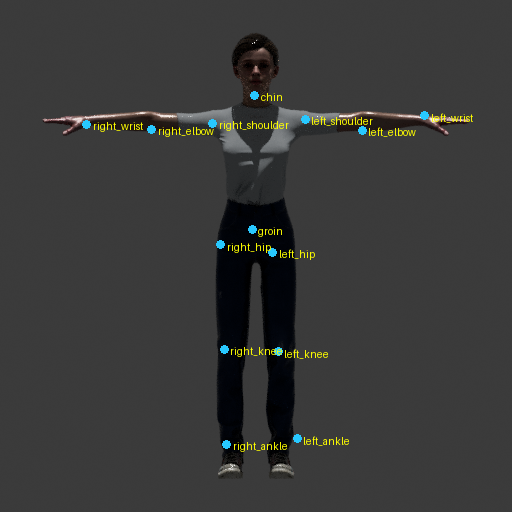
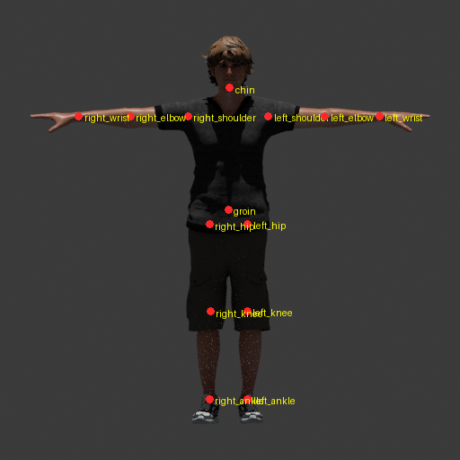

# RigFlow ML — neural network for skeleton landmark detection

A custom-trained neural network that looks at a plain render of a 3D character
and predicts where its **14 body joints** are (shoulders, elbows, wrists, hips,
knees, ankles, chin, groin). Those joint positions drive RigFlow's auto-rigger,
which places a skeleton so animations bind cleanly — no manual rigging.

It's a **2D keypoint / pose-estimation** model: a pretrained ResNet-18
fine-tuned (transfer learning) on automatically-labelled data, with left/right
flip and colour augmentation to stretch a small dataset.

## Result

The network predicting joints on a character it has **never seen during
training** (trained on ~10 models):



Most joints land on the correct body part straight away — and accuracy keeps
improving as the dataset grows.

## How it learns from correct data (no manual labelling)

A model that is *already correctly rigged* is a free, perfectly-labelled
example: render it, and the known bone positions tell you exactly where every
joint is in the image. The data-gen step renders the model and projects its real
skeleton to pixels — that's the answer key. The overlay below is a check image
(dots = the true joint labels read straight from the rig):



This means thousands of perfect training examples can be generated automatically
from free rigged models (e.g. Mixamo), instead of hand-labelling by hand.

## Layout

```
ml/
├── data_gen/     # turn rigged models into training examples (images + labels)
├── train/        # PyTorch training code (dataset, model, training loop)
├── inference/    # load a trained model + predict (feeds the backend rigger)
├── docs/         # showcase images for this README
├── weights/      # trained .pth files        (gitignored — big, regenerable)
├── datasets/     # generated images + labels (gitignored — big, regenerable)
└── requirements.txt
```

## Step 1 — make training data

A correctly-rigged model is a free, perfectly-labelled example: render it, and
the known bone positions tell you exactly where each joint is in the image.
Download rigged humanoids from Mixamo (FBX) and run:

```bash
# 1. render the two views + compute the true joint pixel positions
blender --background --python ml/data_gen/render_keypoints.py -- \
    --fbx "C:/path/to/mixamo_model.fbx" --out "ml/datasets/model_01"

# 2. draw the labels on top so you can CHECK they're right
python ml/data_gen/draw_overlay.py --dir "ml/datasets/model_01"
```

Open `ml/datasets/model_01/front_overlay.png`. Every dot should sit on its
joint. If it does, the example is good. Repeat for ~100 models to build a
dataset, then move on to `train/`.

`front.png` / `side.png` are the network's INPUT (no skeleton drawn).
`labels.json` is the TARGET. The `_overlay.png` images are for your eyes only.

## Step 2 — train the network

Install PyTorch once (CPU build is fine to start):

```bash
pip install torch torchvision
```

Then train on the front views in datasets/:

```bash
python train/train.py --epochs 300
```

It fine-tunes a pretrained ResNet-18 to predict the 14 front-view landmarks,
reports validation error in pixels, and saves the best weights to
`weights/keypoints.pth`.

With only ~14 examples the model OVERFITS (memorises rather than generalises) —
expected. Today's goal is a working loop and a falling loss. Real accuracy needs
hundreds of examples; keep adding Mixamo humanoids and re-running data_gen.

## Step 3 — see what it learned

```bash
python inference/predict.py --image "datasets/model_01/front.png"
```

Writes `front_pred.png` with the network's guessed joints (blue dots). Try a
training image first (should look good), then a brand-new rendered model to test
real generalisation.

- `train/dataset.py`  loads images + labels, does augmentation (L/R flip, jitter)
- `train/model.py`    the ResNet-18 + keypoint head
- `train/train.py`    the training loop
- `inference/predict.py`  load weights + predict on one image (this is what the
  future `local_provider.py` will call from the backend)

## Why our own net can beat Haiku

We only ever train on CORRECT joint positions — auto-generated from already-rigged
models, plus any hand-corrections we make in the editor. We never train on a
guess. Haiku is a general model that's never seen a rig; ours trains on nothing
but rigs, including the weird stylised ones it keeps getting wrong.
